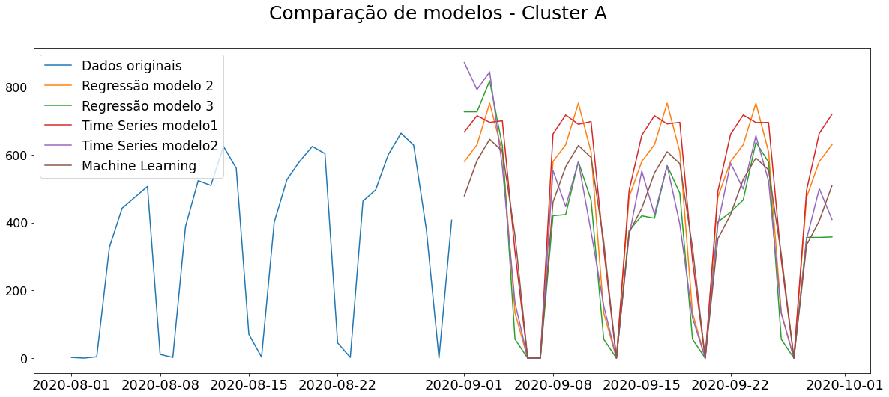

# Previsão de Remessas
Para melhor entendimento da sequência de passos, leia a modelagem na seguinte ordem:
- [Linear Regression](<Linear Regression.ipynb>)
- [Time Series](<Time Series.ipynb>)
- [Machine Learning ](<Machine Learning.ipynb>)

Abaixo segue um gráfico comparando as previsões dos diferentes modelos treinados para o mês de setembro de 2020.

