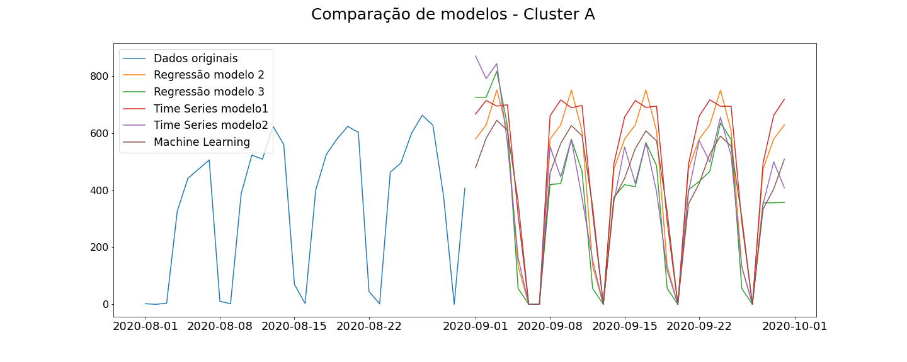
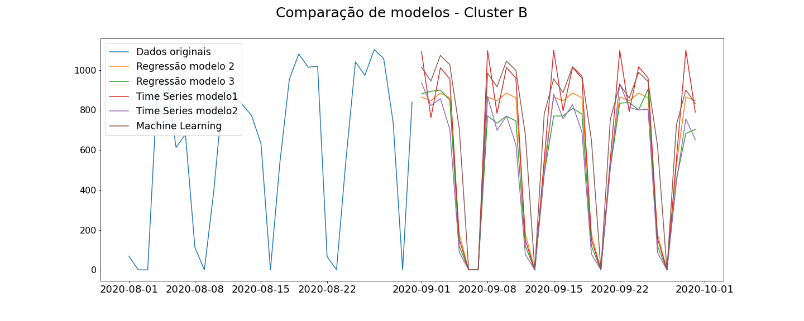
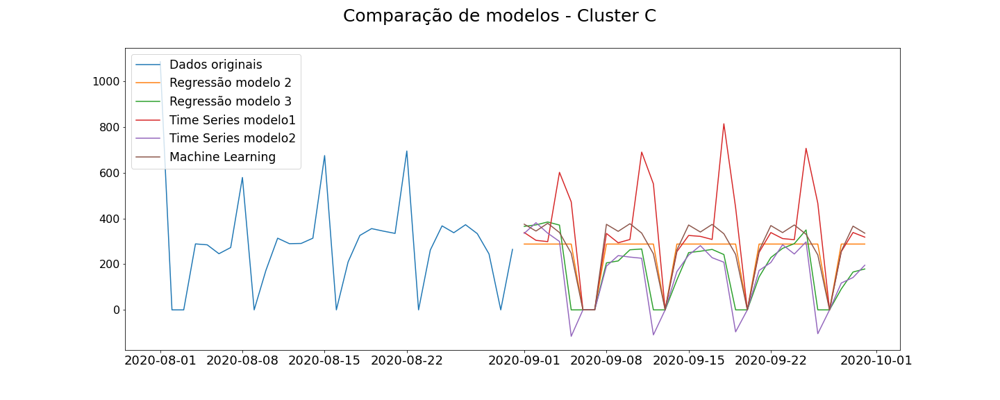
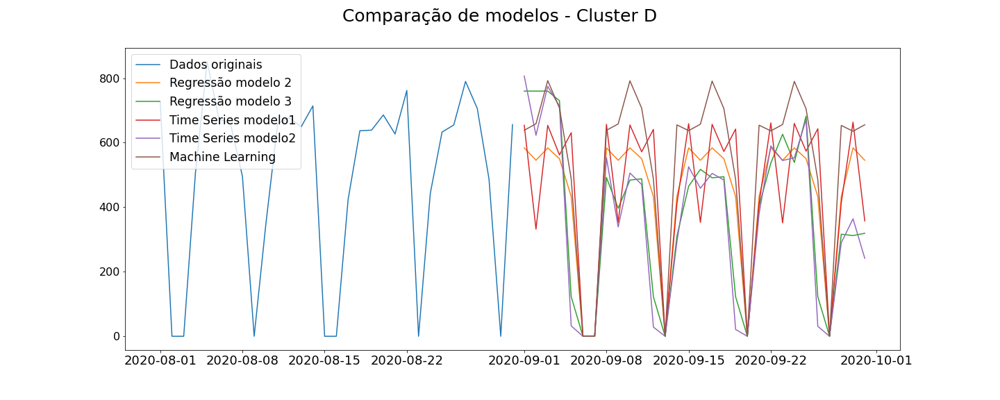
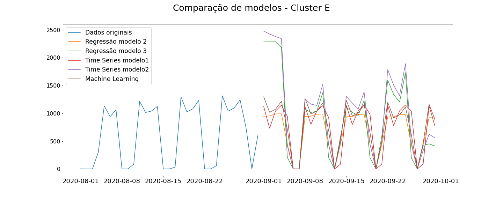
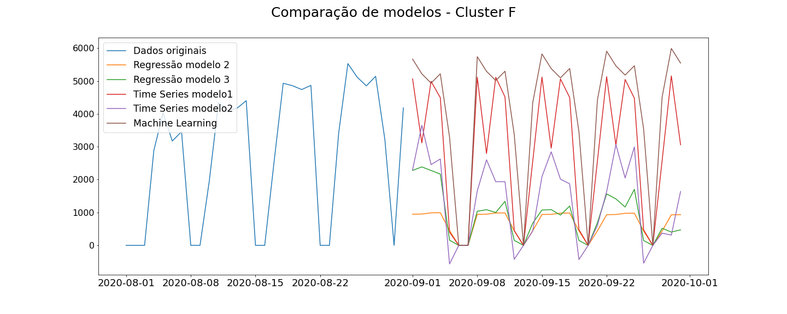
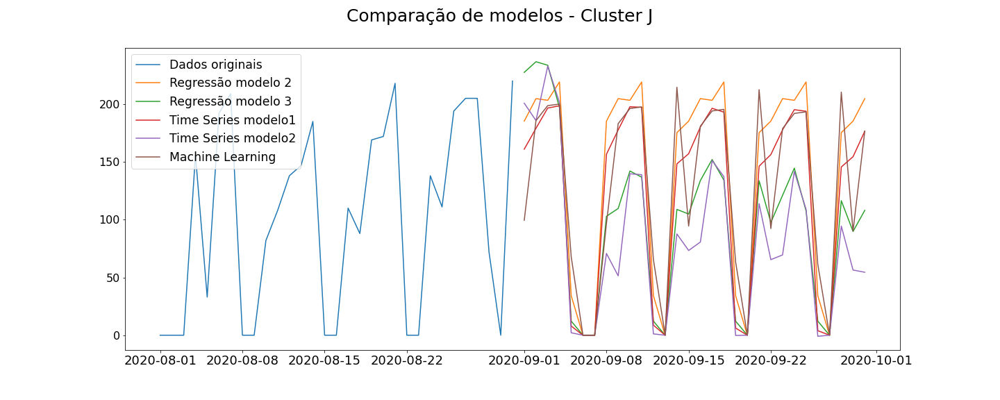
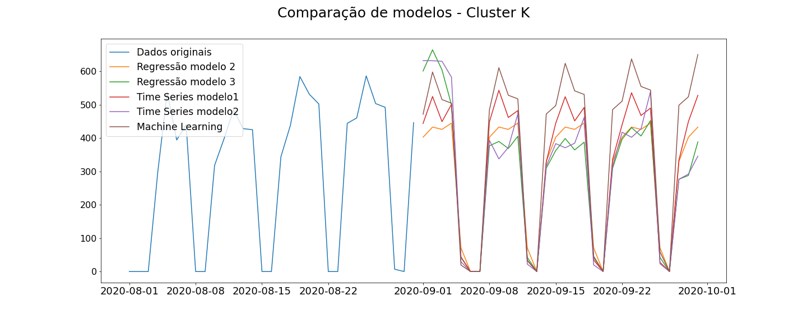
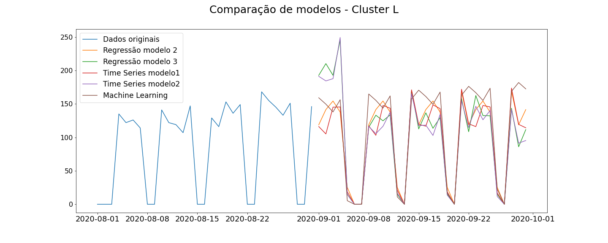
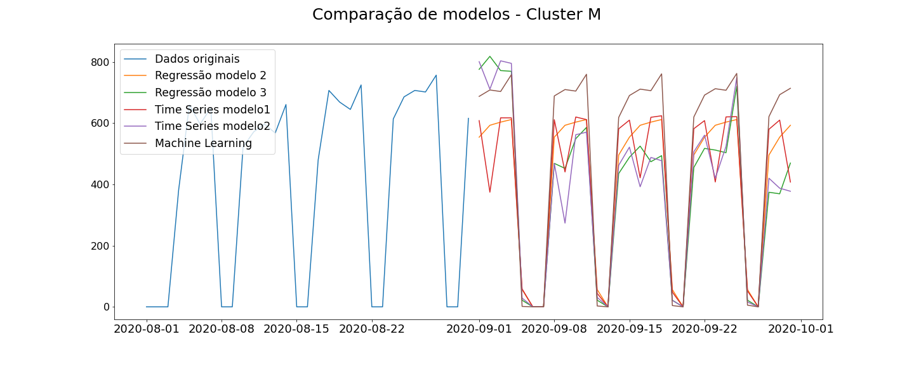

# Previsão de Remessas
Para melhor entendimento da sequência de passos, leia a modelagem na seguinte ordem:
- [Linear Regression](<Linear Regression.ipynb>)
- [Time Series](<Time Series.ipynb>)
- [Machine Learning ](<Machine Learning.ipynb>)

## Excel com forecasts
O Excel com o forecast para setembro de 2020 de todos os modelos para todos os clusters está no arquivo [forecast-set-2020.xlsx](forecast-set-2020.xlsx).

## Gráficos de forecast
Ao todo foram treinados 50 modelos: 5 para cada cluster. Nos gráficos abaixo estão comparados os forecasts feitos por cada modelo para cada cluster.

**Clique no gráfico para vê-lo ampliado!**

|Cluster                       | reg-model2|reg-model3 |reg-ts-model1 |ts-model2 |ml |
|:------------------------------|:---------|:-----------|:-----------|:-----------|:-----------|
|A                    |96.642399|	76.907674	|128.9023871|	105.4132142	|201.9381848|
|A|97|	77|	129|	105|	202|
|B|144|	107|	161|	113|	198|
|C|98	|116	|121	|110	|134|
|D|122	|86	|138|	78	|235|
E|241|	161|	229|	185|	593|
|F|241	|172	|824	|925	|1267|
|J|42	|26|	34	|28	|31|
|K|63|	42	|49|	53|	63|
|L|22|	28	|21	|27	|33|
|M|75|	44|	96|	65|	155|

